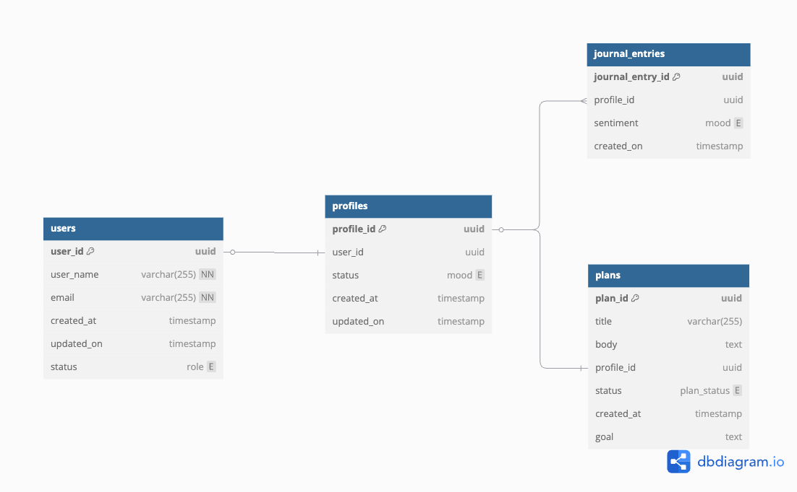

enum role {
  moderator
  user
  admin
}

enum mood {
  very_positive
  somewhat_positive
  neutral
  somewhat_negative
  very_negative
}

enum plan_status {
  planned
  in_progress
  finished
  aborted
}

Table users {
  user_id uuid [primary key]
  user_name varchar(255) [unique, not null]
  email varchar(255) [unique, not null]
  created_at timestamp [default: `now()`]
  updated_on timestamp [default: `now()`]
  status role
}

Table profiles {
  profile_id uuid [primary key]
  user_id uuid [ref: - users.user_id]
  status mood
  created_at timestamp [default: `now()`]
  updated_on timestamp [default: `now()`]
}

Table plans {
  plan_id uuid [primary key]
  title varchar(255)
  body text [note: 'Content of the post']
  profile_id uuid [ref: -profiles.profile_id]
  status plan_status
  created_at timestamp [default: `now()`]
  goal text
}

Table journal_entries {
  journal_entry_id uuid [primary key]
  profile_id uuid [ref: > profiles.profile_id]
  sentiment mood
  created_on timestamp [default: `now()`]
}

[db_schema.pdf](images/db_schema.pdf)
